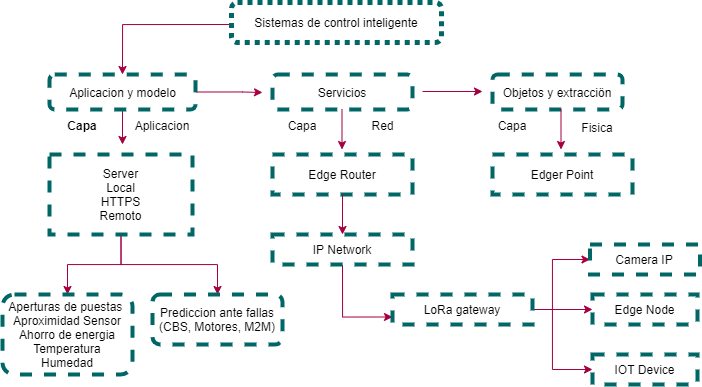
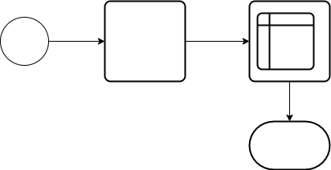

## :trophy: C0.2 Reto en clase

**Conceptos de Industria 4.0 e IOT**

### :blue_book: Instrucciones

- De acuerdo con la información presentada y el video mostrado por el asesor, contestar las preguntas indicadas en la tabla del apartado desarrollo.
- Al concluir el reto se deberá subir en formato PDF a la plataforma con la nomenclatura **C0.2_NombreApellido_Equipo.pdf.**
- Se deberá publicar el reto dentro del repositorio Git personal de cada estudiante, utilizando el estilo MarkDown y el entorno de desarrollo VSCode.
- Es recomendable crear el repositorio siguiente una estructura tal como:
```
- readme.md
  - blog
    - C0.1_x.md
    - C0.2_x.md
  - img
  - docs
    - A0.1_x.md
    - A0.2_x.md
```
  
### :pencil2: Desarrollo

1. Responde a las siguientes preguntas:

| Numero | Pregunta                  | Respuesta  |
| --------------- | --------------------------------------------------- | ---------  |
| 1.1      | A que esta referido el termino Industria conectada? |El concepto Industria 4.0 nació en Alemania en 2012. Consiste en la introducción de las tecnologías digitalicen, la digitalización de los procesos productivos en las fábricas, los Sensores y sistemas de información.|
| 1.2      | ¿Qué es un sistema en tiempo real?                  | Se trata de la implementación de varias tecnologías que juntas logran anticipar los comportamientos del mundo real, ofreciendo un modelo de predicción muy ajustado.           |
| 1.3      | Mencione que tecnologías envuelven el concepto Industria 4.0    | 1)Fabricación aditiva o impresión 3D. 2)Integración de procesos. 3)Ciberseguridad. 4)Realidad aumentada. 5)Cloud Computing. 6)Robótica. 7)Internet de las cosas. 8.)Big data y análisis de datos. 9)Simulación y prototipado. 10)Cultura. |
| 1.4      | Referente al tema automatización industria, en que consiste el nivel de campo?     | Nivel de campo o instrumentación. Incluye a todos los dispositivos físicos presentes en la industria, como son elementos de medida o sensores y elementos.           |
| 1.5      | Elabore un diagrama de capas que muestre la arquitectura de un ecosistema tecnológico para IOT?                       | |
| 1.6      | Que es un sistema de control embebido?               | Se trata de sistemas de control de software que regulan y gestionan dispositivos de hardware. Numéricamente, quizás existen más sistemas embebidos que cualquier otro tipo de sistema. Algunos ejemplos de sistemas embebidos incluyen el software en un teléfono móvil (celular), el software que controla los frenos antibloqueo de un automóvil y el software en un horno de microondas para controlar el proceso de cocinado. |
| 1.7      | Que tecnologías observa en el video referentes al concepto Industria 4.0?         | La robotica, el uso de robot para la realizacion de trabajo, son capaces de aprender nuevas rutas y facilitan la integracion de procesos            |
| 1.8      | Basado en el video que ha ofrecido la robótica en la industria?        | Hay robot colavorativos que ayudan a transportar las piezas de repuesto, tambien pueden interactuar con el personal, es muy facil de usar el robot, facilita las tareas, cualquier empleado se puede sentir familarizados con el mundo de los dispositivos.|
|    |   
 | 
 | 

1. Instale la extension [Draw.io integration](https://marketplace.visualstudio.com/items?itemName=hediet.vscode-drawio) dentro de visual studio code y elabore el diagrama solicitado siguiendo las instrucciones para esta actividad.

    :arrow_forward: [Extension de visual studio code - Draw.io integration](https://www.youtube.com/watch?v=Y47ZlxoDWNI)

2. Coloque el diagrama que se solicita dentro del punto 1.5 en este apartado.
   -Ejemplo de un diagrama de flujo utilizando draw.io



:house: [Ir a inicio](../docs/D0.1_FundamentosElectronicaBasica.md)

